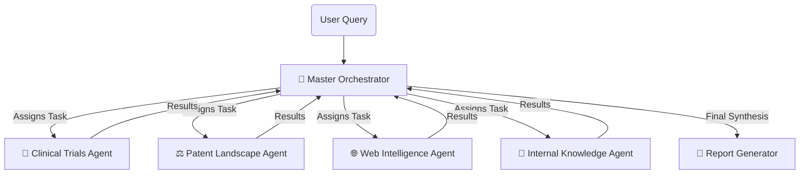

# Jovian AI: Neural Swarm Research Assistant 🧬🧪


**Jovian AI** is an advanced **Agentic Research Assistant** designed to autonomously conduct feasibility analysis for pharmaceutical R&D. Powered by a "Neural Swarm" of specialized AI agents, it aggregates data from clinical trials, patent databases, and market intelligence to generate comprehensive strategic reports.

---

## 🌌 The "Neural Swarm" Architecture

The system mimics a biological swarm, orchestrating multiple specialized agents to solve complex problems:



### 🤖 Specialized Agents
| Agent | Role | Capabilities |
| :--- | :--- | :--- |
| **Master Orchestrator** | Strategy & Planning | Breaks down queries, assigns tasks, and synthesizes findings. |
| **Clinical Trials** | Safety & Efficacy | Queries `ClinicalTrials.gov` for active studies and opportunities. |
| **Patent Landscape** | IP & FTO Analysis | **Dual-Search** (Granted vs Filed) on `PatentsView`. |
| **Web Intelligence** | Market Signals | Real-time web search for market competitors and news. |
| **Report Generator** | Documentation | Compiles all intelligence into a formatted PDF strategy report. |

---

## ✨ Key Features

### 🌑 Soothing Dark Theme
A custom-engineered "Matte Black" (`#121212`) theme designed for long research sessions.
- **Glassmorphism Cards**: Modern, semi-transparent UI elements.
- **High Visibility**: Soft white text (`#e0e0e0`) and high-contrast badges.
- **Visual Intelligence**: Color-coded risk indicators (e.g., <span style="color:#ff3b30"><b>HIGH RISK</b></span>).

### ⚖️ Dual Patent Search
Direct integration with the **PatentsView API** to provide:
- **Granted Patents** (Issued IP).
- **Pre-Grant Applications** (Filed/Pending IP).
- *Strict API Mode*: Delivers raw truth without synthetic hallucinations.

### 📑 Automated Reporting
Generates professional PDFs (`Strategy_Report.pdf`) containing:
- Executive Summary.
- Detailed Intelligence Breakdown.
- Risk Assessments.

---

## 🚀 Getting Started

### Prerequisites
- Python 3.9+
- Google Cloud API Key (for Gemini & Search)

### Installation

1. **Clone the Repository**
   ```bash
   git clone https://github.com/AdityaX18/SentinelV2_hackathon1.git
   cd agentic-workflow
   ```

2. **Install Dependencies**
   ```bash
   pip install -r requirements.txt
   ```

3. **Configure Secrets**
   Open `config.py` and set your API keys:
   ```python
   os.environ["GOOGLE_API_KEY"] = "YOUR_GEMINI_KEY"
   os.environ["GOOGLE_CSE_ID"] = "YOUR_SEARCH_ENGINE_ID"
   ```

### Running the App
Launch the Neural Swarm interface:
```bash
streamlit run gui.py
```

---

## 🎨 Design Philosophy
> *"Complexity should be beautiful."*

Jovian AI is built with a focus on **visual excellence**. The interface avoids generic Bootstrap styles, opting for a bespoke CSS system inspired by Apple's design language—clean, minimal, and typography-driven.

---
*Built with ❤️ by the Jovian AI Team*
